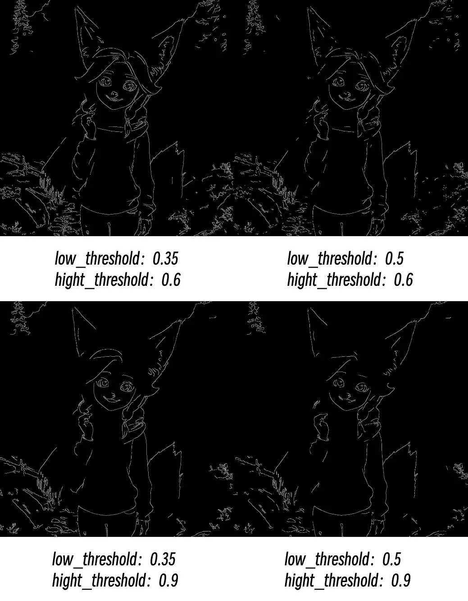

사진에서 모든 경계선을 추출합니다. 펜으로 사진의 윤곽을 그리는 것처럼 객체의 윤곽과 세부 경계를 그려냅니다.

## 작동 원리

펜으로 사진의 윤곽을 그려야 하는 아티스트라고 상상해보세요. Canny 노드는 지능적인 조수처럼 작동하여 어디에 선(경계)을 그릴지, 어디에 그리지 말지를 결정하는 데 도움을 줍니다.

이 과정은 선별 작업과 같습니다:
- **높은 임계값**은 "반드시 선을 그어야 하는 기준"입니다: 사람의 얼굴 윤곽이나 건물 프레임과 같이 매우 명확하고 뚜렷한 윤곽선만 그려집니다
- **낮은 임계값**은 "절대 선을 그리지 않는 기준"입니다: 너무 약한 경계는 무시되어 노이즈와 의미 없는 선을 그리는 것을 방지합니다
- **중간 영역**: 두 기준 사이의 경계는 "필수 선"에 연결된 경우 함께 그려지지만, 고립된 경우에는 그려지지 않습니다

최종 출력은 흑백 이미지로, 흰색 부분은 감지된 경계선이고 검은색 부분은 경계가 없는 영역입니다.

## 입력 매개변수

| 매개변수 이름 | 데이터 유형 | 입력 방법 | 기본값 | 값 범위 | 기능 설명 |
|-------------|-------------|----------|--------|---------|----------|
| 이미지 | IMAGE | 연결 | - | - | 경계 추출이 필요한 원본 사진 |
| 낮은 임계값 | FLOAT | 수동 입력 | 0.4 | 0.01-0.99 | 낮은 임계값, 무시할 약한 경계의 정도를 결정. 값이 낮을수록 더 많은 세부사항이 보존되지만 노이즈가 발생할 수 있음 |
| 높은 임계값 | FLOAT | 수동 입력 | 0.8 | 0.01-0.99 | 높은 임계값, 보존할 강한 경계의 정도를 결정. 값이 높을수록 가장 명확한 윤곽선만 유지됨 |

## 출력 결과

| 출력 이름 | 데이터 유형 | 설명 |
|----------|-------------|------|
| 이미지 | IMAGE | 흑백 경계 이미지, 흰 선은 감지된 경계, 검은 영역은 경계가 없는 부분 |

## 매개변수 비교

**일반적인 문제:**
- 경계가 끊어짐: 높은 임계값을 낮춰보세요
- 노이즈가 너무 많음: 낮은 임계값을 높이세요
- 중요한 세부사항이 누락됨: 낮은 임계값을 낮추세요
- 경계가 너무 거침: 입력 이미지의 품질과 해상도를 확인하세요
