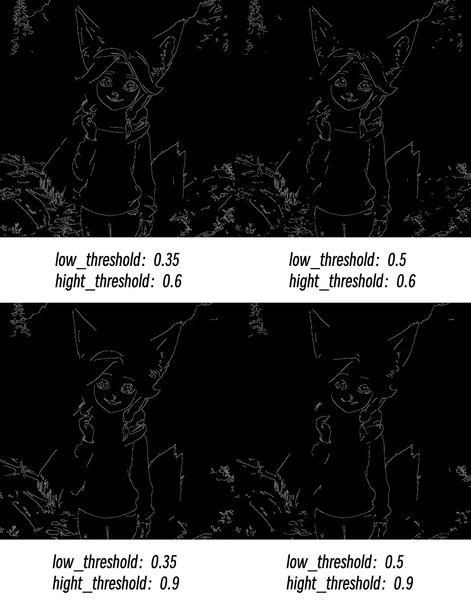

# Canny

Extraia todas as linhas de borda de fotos, como usar uma caneta para contornar uma foto, traçando os contornos e limites de detalhes dos objetos.

## Princípio de funcionamento

Imagine que você é um artista que precisa usar uma caneta para contornar uma foto. O nó Canny funciona como um assistente inteligente, ajudando você a decidir onde desenhar linhas (bordas) e onde não desenhar.

Esse processo é como um trabalho de triagem:

- **Limiar alto** é o "padrão de linhas que devem ser desenhadas": apenas linhas de contorno muito evidentes e nítidas serão desenhadas, como contornos faciais de pessoas e estruturas de edifícios
- **Limiar baixo** é o "padrão de linhas que definitivamente não devem ser desenhadas": bordas fracas demais serão ignoradas para evitar desenhar ruído e linhas sem significado
- **Área intermediária**: bordas entre os dois padrões serão desenhadas em conjunto se estiverem conectadas a "linhas que devem ser desenhadas", mas não serão desenhadas se estiverem isoladas

A saída final é uma imagem em preto e branco, em que as partes brancas são linhas de borda detectadas e as partes pretas são áreas sem bordas.

## Entradas

| Nome do parâmetro | Descrição da função | Tipo de dados | Tipo de entrada | Padrão | Intervalo |
| --- | --- | --- | --- | --- | --- |
| `image` | Foto original que precisa de extração de bordas | IMAGE | Entrada | - | - |
| `low_threshold` | Limiar baixo; determina quão fracas as bordas podem ser antes de serem ignoradas. Valores menores preservam mais detalhes, mas podem gerar ruído | FLOAT | Widget | 0.4 | 0.01-0.99 |
| `high_threshold` | Limiar alto; determina quão fortes as bordas devem ser para serem preservadas. Valores maiores mantêm apenas as linhas de contorno mais evidentes | FLOAT | Widget | 0.8 | 0.01-0.99 |

## Saídas

| Nome da saída | Descrição | Tipo de dados |
| --- | --- | --- |
| `image` | Imagem de bordas em preto e branco; linhas brancas são bordas detectadas, áreas pretas são partes sem bordas | IMAGE |

## Comparação de parâmetros

**Problemas comuns:**

- Bordas quebradas: Tente diminuir o limiar alto
- Muito ruído: Aumente o limiar baixo
- Detalhes importantes ausentes: Diminua o limiar baixo
- Bordas muito irregulares: Verifique a qualidade e a resolução da imagem de entrada

> Esta documentação foi gerada por IA. Se você encontrar erros ou tiver sugestões de melhoria, sinta-se à vontade para contribuir! [Editar no GitHub](https://github.com/Comfy-Org/embedded-docs/blob/main/comfyui_embedded_docs/docs/Canny/pt-BR.md)
