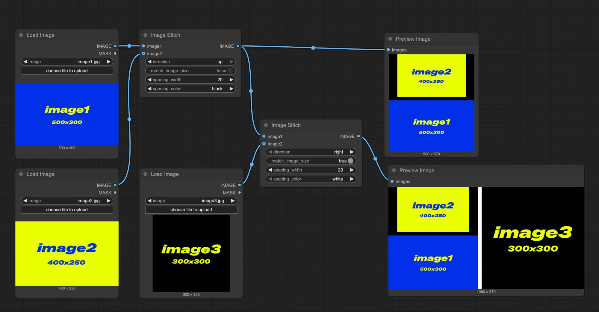

> Esta documentação foi gerada por IA. Se você encontrar erros ou tiver sugestões de melhoria, sinta-se à vontade para contribuir! [Editar no GitHub](https://github.com/Comfy-Org/embedded-docs/blob/main/comfyui_embedded_docs/docs/ImageStitch/pt-BR.md)

Este nó permite unir duas imagens em uma direção especificada (cima, baixo, esquerda, direita), com suporte para correspondência de tamanhos e espaçamento entre as imagens.

## Entradas

| Nome do Parâmetro | Tipo de Dados | Tipo de Entrada | Padrão | Faixa | Descrição |
|-------------------|---------------|-----------------|--------|-------|-----------|
| `image1` | IMAGE | Obrigatório | - | - | A primeira imagem a ser unida |
| `image2` | IMAGE | Opcional | Nenhum | - | A segunda imagem a ser unida; se não for fornecida, retorna apenas a primeira imagem |
| `direction` | STRING | Obrigatório | right | right/down/left/up | A direção para unir a segunda imagem: direita, baixo, esquerda ou cima |
| `match_image_size` | BOOLEAN | Obrigatório | True | True/False | Se deve redimensionar a segunda imagem para corresponder às dimensões da primeira imagem |
| `spacing_width` | INT | Obrigatório | 0 | 0-1024 | Largura do espaçamento entre as imagens, deve ser um número par |
| `spacing_color` | STRING | Obrigatório | white | white/black/red/green/blue | Cor do espaçamento entre as imagens unidas |

> Para `spacing_color`, ao usar cores diferentes de "white/black", se `match_image_size` estiver definido como `false`, a área de preenchimento será preenchida com preto

## Saídas

| Nome da Saída | Tipo de Dados | Descrição |
|---------------|---------------|-----------|
| `IMAGE` | IMAGE | A imagem unida |

## Exemplo de Fluxo de Trabalho

No fluxo de trabalho abaixo, usamos 3 imagens de entrada de tamanhos diferentes como exemplo:

- image1: 500x300
- image2: 400x250
- image3: 300x300

**Primeiro Nó de União de Imagens**

- `match_image_size`: false, as imagens serão unidas em seus tamanhos originais
- `direction`: up, `image2` será colocada acima de `image1`
- `spacing_width`: 20
- `spacing_color`: black

Imagem de saída 1:

**Segundo Nó de União de Imagens**

- `match_image_size`: true, a segunda imagem será redimensionada para corresponder à altura ou largura da primeira imagem
- `direction`: right, `image3` aparecerá no lado direito
- `spacing_width`: 20
- `spacing_color`: white

Imagem de saída 2:

