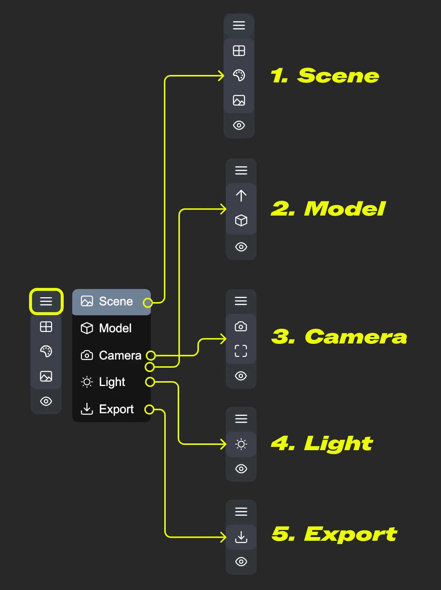

The Load3D node is a core node for loading and processing 3D model files. When loading the node, it automatically retrieves available 3D resources from `ComfyUI/input/3d/`. You can also upload supported 3D files for preview using the upload function.

**Supported Formats**
Currently, this node supports multiple 3D file formats, including `.gltf`, `.glb`, `.obj`, `.fbx`, and `.stl`.

**3D Node Preferences**
Some related preferences for 3D nodes can be configured in ComfyUI's settings menu. Please refer to the following documentation for corresponding settings:

[Settings Menu](https://docs.comfy.org/interface/settings/3d)

Besides regular node outputs, Load3D has lots of 3D view-related settings in the canvas menu.

## Inputs

| Parameter Name | Type     | Description                     | Default | Range        |
|---------------|----------|---------------------------------|---------|--------------|
| model_file    | File Selection | 3D model file path, supports upload, defaults to reading model files from `ComfyUI/input/3d/` | - | Supported formats |
| width         | INT      | Canvas rendering width          | 1024    | 1-4096      |
| height        | INT      | Canvas rendering height         | 1024    | 1-4096      |

## Outputs

| Parameter Name   | Data Type      | Description                        |
|-----------------|----------------|------------------------------------|
| image           | IMAGE          | Canvas rendered image              |
| mask            | MASK           | Mask containing current model position |
| mesh_path       | STRING         | Model file path                   |
| normal          | IMAGE          | Normal map                         |
| lineart         | IMAGE          | Line art image output, corresponding `edge_threshold` can be adjusted in the canvas model menu |
| camera_info     | LOAD3D_CAMERA  | Camera information                 |
| recording_video | VIDEO          | Recorded video (only when recording exists) |

All the outputs preview:

## Canvas Area Description

The Load3D node's Canvas area contains numerous view operations, including:
- Preview view settings (grid, background color, preview view)
- Camera control: Control FOV, camera type
- Global illumination intensity: Adjust lighting intensity
- Video recording: Record and export videos
- Model export: Supports `GLB`, `OBJ`, `STL` formats
- And more

1. Contains multiple menus and hidden menus of the Load 3D node
2. Menu for `resizing preview window` and `canvas video recording`
3. 3D view operation axis
4. Preview thumbnail
5. Preview size settings, scale preview view display by setting dimensions and then resizing window

### 1. View Operations

<video controls width="640" height="360">
  <source src="./asset/view_operations.mp4" type="video/mp4">
  Your browser does not support video playback.
</video>

View control operations:
- Left-click + drag: Rotate the view
- Right-click + drag: Pan the view
- Middle wheel scroll or middle-click + drag: Zoom in/out
- Coordinate axis: Switch views

### 2. Left Menu Functions

In the canvas, some settings are hidden in the menu. Click the menu button to expand different menus
- 1. Scene: Contains preview window grid, background color, preview settings
- 2. Model: Model rendering mode, texture materials, up direction settings
- 3. Camera: Switch between orthographic and perspective views, and set the perspective angle size
- 4. Light: Scene global illumination intensity
- 5. Export: Export model to other formats (GLB, OBJ, STL)

#### Scene

The Scene menu provides some basic scene setting functions
1. Show/Hide grid
2. Set background color
3. Click to upload a background image
4. Hide the preview

#### Model

The Model menu provides some model-related functions
1. **Up direction**: Determine which axis is the up direction for the model
2. **Material mode**: Switch model rendering modes - Original, Normal, Wireframe, Lineart
3. **Upload texture**: Allows adding textures to the model

#### Camera

This menu provides switching between orthographic and perspective views, and perspective angle size settings
1. **Camera**: Quickly switch between orthographic and orthographic views
2. **FOV**: Adjust FOV angle

#### Light

Through this menu, you can quickly adjust the scene's global illumination intensity

#### Export

This menu provides the ability to quickly convert and export model formats

### 3. Right Menu Functions

<video controls width="640" height="360">
  <source src="./asset/recording.mp4" type="video/mp4">
  Your browser does not support video playback.
</video>

The right menu has two main functions:
1. **Reset view ratio**: After clicking the button, the view will adjust the canvas rendering area ratio according to the set width and height
2. **Video recording**: Allows you to record current 3D view operations as video, allows import, and can be output as `recording_video` to subsequent nodes
