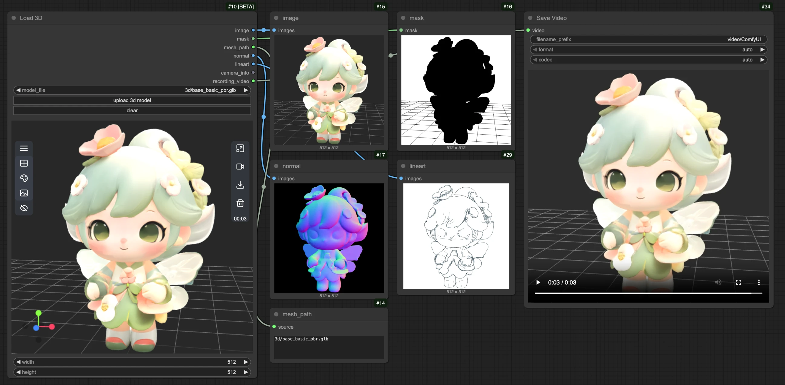
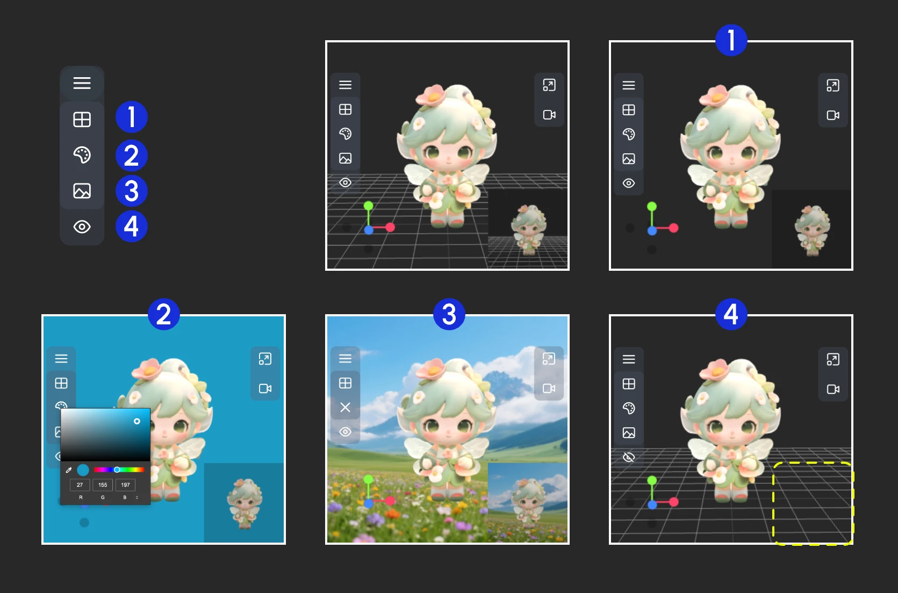

El nodo Load3D es un nodo principal para cargar y procesar archivos de modelos 3D. Al cargar el nodo, obtiene automáticamente los recursos 3D disponibles en `ComfyUI/input/3d/`. También puedes subir archivos 3D compatibles para previsualizarlos usando la función de carga.

**Formatos soportados**
Actualmente, este nodo soporta varios formatos de archivos 3D, incluyendo `.gltf`, `.glb`, `.obj`, `.fbx` y `.stl`.

**Preferencias del nodo 3D**
Algunas preferencias relacionadas con los nodos 3D se pueden configurar en el menú de configuración de ComfyUI. Consulta el siguiente documento para ver los ajustes correspondientes:

[Menú de configuración](https://docs.comfy.org/interface/settings/3d)

Además de las salidas habituales del nodo, Load3D tiene muchas opciones relacionadas con la vista 3D en el menú del área de previsualización.

## Entradas

| Nombre del parámetro | Tipo           | Descripción                                                        | Predeterminado | Rango         |
|---------------------|----------------|--------------------------------------------------------------------|----------------|---------------|
| model_file          | File Selection | Ruta del archivo del modelo 3D, soporta carga, por defecto lee archivos de `ComfyUI/input/3d/` | -              | Formatos soportados |
| width               | INT            | Ancho de renderizado del lienzo                                    | 1024           | 1-4096        |
| height              | INT            | Alto de renderizado del lienzo                                     | 1024           | 1-4096        |

## Salidas

| Nombre de salida    | Tipo de dato   | Descripción                                                        |
|--------------------|----------------|--------------------------------------------------------------------|
| image              | IMAGE          | Imagen renderizada en el lienzo                                    |
| mask               | MASK           | Máscara que contiene la posición actual del modelo                 |
| mesh_path          | STRING         | Ruta del archivo del modelo (dentro de la carpeta `ComfyUI/input`) |
| normal             | IMAGE          | Mapa de normales                                                   |
| lineart            | IMAGE          | Salida de imagen de dibujo lineal, el `edge_threshold` se puede ajustar en el menú de modelo del lienzo |
| camera_info        | LOAD3D_CAMERA  | Información de la cámara                                           |
| recording_video    | VIDEO          | Video grabado (solo si existe grabación)                           |

Vista previa de todas las salidas:

## Descripción del área de lienzo (Canvas)

El área Canvas del nodo Load3D contiene numerosas operaciones de vista, incluyendo:
- Configuración de vista previa (cuadrícula, color de fondo, vista previa)
- Control de cámara: controlar FOV, tipo de cámara
- Intensidad de iluminación global: ajustar la intensidad de la luz
- Grabación de video: grabar y exportar videos
- Exportación de modelo: soporta formatos `GLB`, `OBJ`, `STL`
- Etc.

1. Incluye varios menús y menús ocultos del nodo Load 3D
2. Menú para redimensionar la ventana de previsualización y grabar video del lienzo
3. Eje de operaciones de vista 3D
4. Miniatura de previsualización
5. Configuración del tamaño de la previsualización, ajusta la visualización de la vista previa configurando dimensiones y luego redimensionando la ventana

### 1. Operaciones de vista

<video controls width="640" height="360">
  <source src="./asset/view_operations.mp4" type="video/mp4">
  Tu navegador no soporta la reproducción de video.
</video>

Operaciones de control de vista:
- Clic izquierdo + arrastrar: rotar la vista
- Clic derecho + arrastrar: mover la vista
- Rueda del ratón o clic central: acercar/alejar
- Eje de coordenadas: cambiar de vista

### 2. Funciones del menú izquierdo

En el área de previsualización, algunos menús relacionados con operaciones de vista están ocultos en el menú. Haz clic en el botón de menú para expandir los diferentes menús
- 1. Escena (Scene): incluye cuadrícula de la ventana de previsualización, color de fondo, configuración de miniatura
- 2. Modelo (Model): modo de renderizado del modelo, materiales de textura, configuración de dirección superior
- 3. Cámara (Camera): cambiar entre vista ortográfica y perspectiva, y ajustar el ángulo de perspectiva
- 4. Luz (Light): intensidad de iluminación global de la escena
- 5. Exportar (Export): exportar el modelo a otros formatos (GLB, OBJ, STL)

#### Escena (Scene)

El menú Escena proporciona algunas funciones básicas de configuración de la escena
1. Mostrar/ocultar cuadrícula
2. Establecer color de fondo
3. Subir imagen de fondo
4. Ocultar miniatura de previsualización

#### Modelo (Model)

El menú Modelo proporciona algunas funciones relacionadas con el modelo
1. **Dirección superior (Up direction)**: determina qué eje es la dirección superior del modelo
2. **Modo de material (Material mode)**: cambiar modos de renderizado del modelo - Original, Normal, Malla, Dibujo lineal
3. **Subir textura (Upload texture)**: permite añadir texturas al modelo (solo ejemplo)

#### Cámara (Camera)

Este menú permite cambiar entre vistas ortográfica y perspectiva, y ajustar el ángulo de perspectiva
1. **Cámara (Camera)**: cambiar rápidamente entre vistas ortográfica y perspectiva
2. **FOV**: ajustar el ángulo FOV

#### Luz (Light)

A través de este menú puedes ajustar rápidamente la intensidad de la iluminación global de la escena

#### Exportar (Export)

Este menú permite convertir y exportar rápidamente formatos de modelo

### 3. Funciones del menú derecho

<video controls width="640" height="360">
  <source src="./asset/recording.mp4" type="video/mp4">
  Tu navegador no soporta la reproducción de video.
</video>

El menú derecho tiene dos funciones principales:
1. **Restablecer proporción de vista**: al hacer clic en el botón, la vista ajustará la proporción del área de renderizado del lienzo según el ancho y alto establecidos
2. **Grabación de video**: permite grabar las operaciones actuales de vista 3D como video, permite importar y puede ser salida como `recording_video` a nodos posteriores
