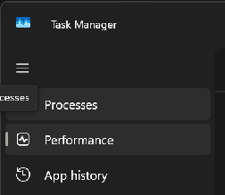
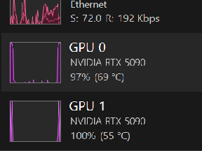

> تم إعداد هذه الوثيقة بمساعدة الذكاء الاصطناعي. إذا لاحظت أي خطأ أو كان لديك اقتراح لتحسينها، فمساهمتك مرحب بها دائمًا! [حرر على GitHub](https://github.com/Comfy-Org/embedded-docs/blob/main/comfyui_embedded_docs/docs/MultiGPU_WorkUnits/ar.md)

## نظرة عامة

تسمح عقدة MultiGPU CFG Split بتنفيذ جزء الانتشار من سير العمل باستخدام أكثر من GPU داخل نفس الجهاز. تختلف النتيجة حسب سير العمل، لكن تم تسجيل زيادات في السرعة تصل إلى نحو 1.95x في بعض الاستخدامات الشائعة.

## تفاصيل مهمة

لا يمكن خلط أنواع مختلفة من وحدات GPU. يجب أن تكون البطاقات المثبتة من النوع نفسه، مثل 2x 5090 أو 2x 5080.

سيكتشف ComfyUI تلقائيًا وجود أكثر من GPU عند بدء التشغيل.

## وحدات GPU المدعومة

أي إعداد يحتوي على بطاقتين متماثلتين مع معمارية Ampere أو أحدث، مثل 2 x 3090 أو 2 x RTX6000 Pro.

## النماذج المدعومة

* LTX-2.3  
* WAN 2.2  
* FLUX.2 Klein \- Base Versions  
* Z-Image  
* Stable Diffusion 3.5 Large  
* Hunyuan Video  
* Qwen-Image-Edit-2511  
* Hunyuan-3D-v2.1  
* SDXL

## المدخلات

| اسم المعامل | نوع البيانات | مطلوب | النطاق | الوصف |
|-------------|--------------|-------|--------|-------|
| `model` | MODEL | نعم | غير متاح | النموذج الذي سيتم تجهيزه لتقسيم CFG على عدة وحدات GPU قبل بدء أخذ العينات. |
| `max_gpus` | INT | نعم | الحد الأدنى: 1 الخطوة: 1 الافتراضي: 2 | أكبر عدد من وحدات GPU المتماثلة التي تريد استخدامها لتقسيم العمل. اضبطه على عدد البطاقات المتطابقة المثبتة في جهازك. |

## المخرجات

| اسم المخرج | نوع البيانات | الوصف |
|------------|--------------|-------|
| `MODEL` | MODEL | النموذج بعد تجهيزه لتقسيم CFG على عدة وحدات GPU، ويكون جاهزًا لأخذ العينات بشكل أسرع. |

## موضع العقدة وملاحظات سير العمل

  
يجب ضبط الحقل `max_gpus` على أكبر عدد من وحدات GPU المتماثلة المثبتة في النظام.

**موضع العقدة:** يجب وضع MultiGPU CFG Split بين عقدة تحميل النموذج وعقدة أخذ العينات. إذا كانت هناك عقد أخرى متصلة بمخرج النموذج من عقدة التحميل، فيجب أن تكون MultiGPU CFG Split آخر عقدة في هذا المسار قبل عقدة أخذ العينات.

**ملاحظات سير العمل:** تعمل هذه العقدة من خلال تقسيم سير عمل الانتشار عند مستوى CFG، لذلك يجب أن تكون قيمة CFG في سير العمل أكبر من 1. أما تدفقات العمل المقطرة التي تحتاج إلى `CFG=1` فلن تحصل عادة على فائدة واضحة في الأداء عند استخدام MultiGPU CFG Split مع عدة وحدات GPU.

## التحقق من استخدام عدة وحدات GPU

عند تشغيل سير عمل مع تفعيل MultiGPU CFG Split، يمكنك فتح Windows Task Manager ثم اختيار قسم الأداء.  
  
  
أثناء عمل أداة أخذ العينات في سير العمل، يفترض أن ترى نشاطًا على كلتا وحدتي GPU المثبتتين.

## المشكلات المعروفة

سيتم تحديث هذا القسم لاحقًا.

## رابط سير عمل تجريبي

[https://drive.google.com/file/d/1VORVx7rMPSH9rY1HD2hCujcHa2vB9rzv/view?usp=drive\_link](https://drive.google.com/file/d/1VORVx7rMPSH9rY1HD2hCujcHa2vB9rzv/view?usp=drive_link)

---
**Source fingerprint (SHA-256):** `7293ee785e29aea9a1a70a10444b99e89fb23c866505628ec57c209a2b8aaee0`
