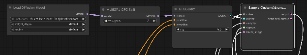
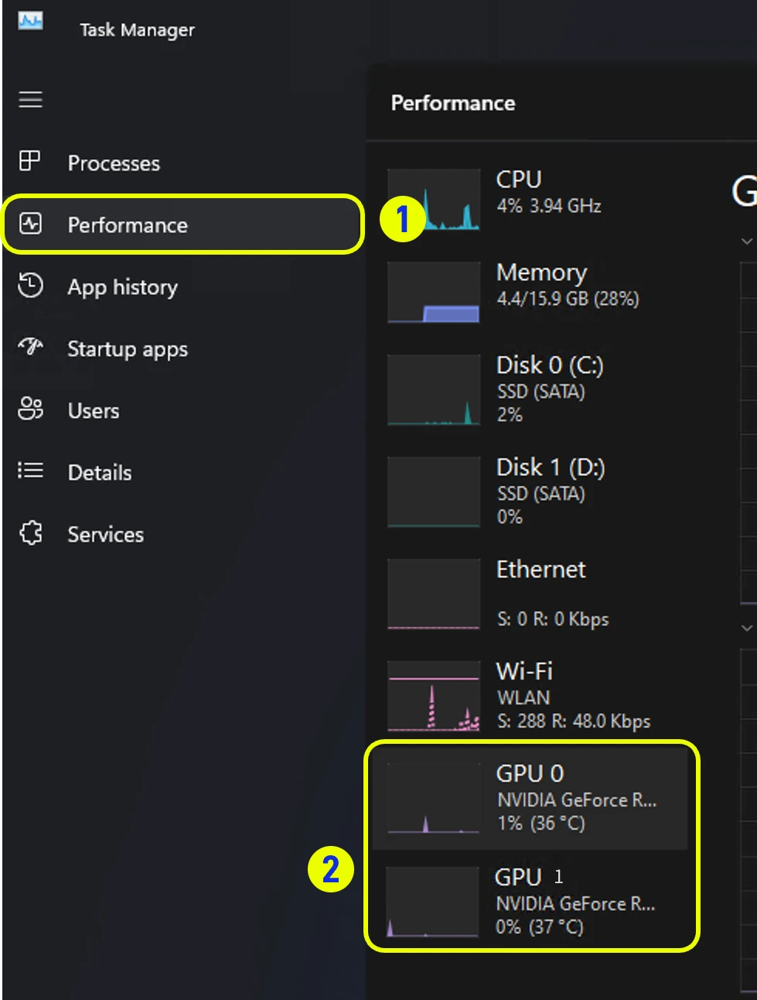

> این مستند با کمک هوش مصنوعی تهیه شده است. اگر خطایی دیدید یا پیشنهادی برای بهتر شدن آن دارید، خوشحال می‌شویم مشارکت کنید! [ویرایش در GitHub](https://github.com/Comfy-Org/embedded-docs/blob/main/comfyui_embedded_docs/docs/MultiGPU_WorkUnits/fa.md)

## مرور کلی

گره MultiGPU CFG Split کمک می‌کند بخش diffusion در یک گردش کار با چند GPU داخل یک سیستم اجرا شود. نتیجه به نوع گردش کار بستگی دارد، اما در بعضی گردش کارهای رایج افزایش سرعتی تا حدود 1.95x دیده شده است.

## نکات مهم

ترکیب GPUهای متفاوت پشتیبانی نمی‌شود. GPUهای نصب‌شده باید از یک نوع باشند؛ مثلا 2x 5090 یا 2x 5080.

ComfyUI هنگام شروع به کار، چند GPU بودن سیستم را به صورت خودکار تشخیص می‌دهد.

## GPUهای پشتیبانی‌شده

هر پیکربندی دو GPU همسان با معماری Ampere یا جدیدتر، مثل 2 x 3090 یا 2 x RTX6000 Pro.

## مدل‌های پشتیبانی‌شده

* LTX-2.3  
* WAN 2.2  
* FLUX.2 Klein \- Base Versions  
* Z-Image  
* Stable Diffusion 3.5 Large  
* Hunyuan Video  
* Qwen-Image-Edit-2511  
* Hunyuan-3D-v2.1  
* SDXL

## ورودی‌ها

| نام پارامتر | نوع داده | الزامی | محدوده | توضیحات |
|-------------|----------|--------|--------|---------|
| `model` | MODEL | بله | N/A | مدلی که باید پیش از نمونه‌گیری برای تقسیم CFG روی چند GPU آماده شود. |
| `max_gpus` | INT | بله | Minimum: 1 Step: 1 Default: 2 | بیشترین تعداد GPUهای همسانی که می‌خواهید برای تقسیم کار استفاده شوند. این مقدار را برابر تعداد GPUهای مشابه نصب‌شده در سیستم قرار دهید. |

## خروجی‌ها

| نام خروجی | نوع داده | توضیحات |
|-----------|----------|---------|
| `MODEL` | MODEL | مدلی که برای تقسیم CFG روی چند GPU آماده شده و برای نمونه‌گیری سریع‌تر آماده است. |

## محل قرارگیری گره و نکات گردش کار

  
فیلد `max_gpus` باید روی بیشترین تعداد GPUهای همسان نصب‌شده در سیستم تنظیم شود.

**محل قرارگیری گره:** گره MultiGPU CFG Split باید بین گره بارگذاری مدل و گره نمونه‌گیری قرار بگیرد. اگر گره‌های دیگری هم به خروجی مدل از گره بارگذاری مدل وصل هستند، MultiGPU CFG Split باید آخرین گره در این زنجیره و درست قبل از گره نمونه‌گیری باشد.

**نکات گردش کار:** این گره با تقسیم فرایند diffusion در سطح CFG کار می‌کند. به همین دلیل مقدار CFG در گردش کار باید بیشتر از 1 باشد. گردش کارهای distilled که به `CFG=1` نیاز دارند، معمولا با استفاده از MultiGPU CFG Split روی چند GPU افزایش کارایی محسوسی نشان نمی‌دهند.

## بررسی استفاده از چند GPU

وقتی یک گردش کار را با MultiGPU CFG Split اجرا می‌کنید، می‌توانید Windows Task Manager را باز کرده و بخش Performance را انتخاب کنید.  
  
  
در زمانی که نمونه گیر در گردش کار در حال اجرا است، باید روی هر دو GPU نصب‌شده فعالیت ببینید.

## مشکلات شناخته‌شده

این بخش بعدا تکمیل می‌شود.

## لینک workflow نمونه

[https://drive.google.com/file/d/1VORVx7rMPSH9rY1HD2hCujcHa2vB9rzv/view?usp=drive\_link](https://drive.google.com/file/d/1VORVx7rMPSH9rY1HD2hCujcHa2vB9rzv/view?usp=drive_link)

---
**Source fingerprint (SHA-256):** `7293ee785e29aea9a1a70a10444b99e89fb23c866505628ec57c209a2b8aaee0`
